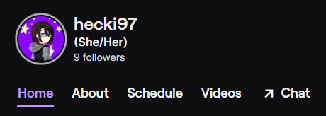
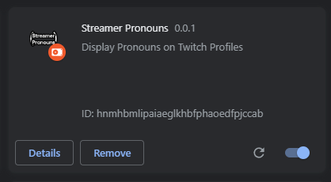
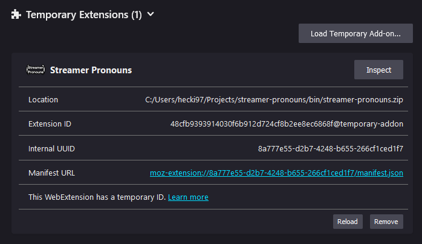

# Streamer Pronouns

Display Pronouns on Twitch Profiles 

# Compatibility

| State                      | Extension                                    |
| ---                        | ---                                          |
| ✅ Supported              | [Vanilla Twitch](https://www.twitch.tv)      |
| ✅ Supported              | [FrankerFaceZ](https://www.frankerfacez.com) |
| ❔ Unknown/Planned        | [BetterTTV](https://betterttv.com)           |
| ❓ Unknown/Not interested | [7TV](https://7tv.app)                       |

> **Note:** I don't know whether the extensions works in 7TV or not, but I'm not interested in neither checking nor adding compatibility. 7TV was created entirely or in part to host a racist blackface emote that was previously banned from BetterTTV. I do not condone this and refuse to engage with such extensions. For more information: https://web.archive.org/web/20220228210246/https://twitter.com/imZaytri/status/1461147801144868873

# Install

> **Note:** A release in the Chrome and Firefox Web Stores is planned

Download the newest release from https://github.com/hecki97/streamer-pronouns/releases

### Chrome or Chromium-based Browsers

1. Unpack the latest release after downloading it
2. Open `chrome://extensions` in your browser
3. Enable `Developer Mode` in the upper right hand corner if it's not already on 
4. Click on `Load Unpacked` at the top left hand side of the screen and select the unpacked directory
5. The extension should show up like this:

6. Visit the twitch profile of someone who uses Alejo Pereyra's [pronoun service](https://pronouns.alejo.io/)

### Firefox

1. Open `about:debugging#/runtime/this-firefox` in your browser
2. Click on `Load Temporary Add-on...` and select the downloaded zip file(or )

> **Note:** Temporary Add-ons in Firefox are only available in the current window and have to be loaded every time a new window is created or Firefox is closed and opened again

3. The extension should show up like this:

1. Visit the twitch profile of someone who uses Alejo Pereyra's [pronoun service](https://pronouns.alejo.io/)

### Safari on iOS and macOS

> **Note:** Support for Safari on iOS and macOS is planned in the form of an UserScript

# Building

1. Clone this repository
2. Make sure you fulfil the following requirements:
   - NodeJS v18.12.0+
   - NPM v8.19.2+
3. Install project dependencies with `npm install`
4. Execute one or more of the following scripts

- `npm run build` - Creates a new minified build in the `dist` directory
- `npm run build:dev` - Creates a new dev build in the `dist` directory
- `npm run dist` - Creates a zip archive of the `dist` directory and places it in `bin`

# License
The source code is this repository is available under the [MIT License](LICENSE).